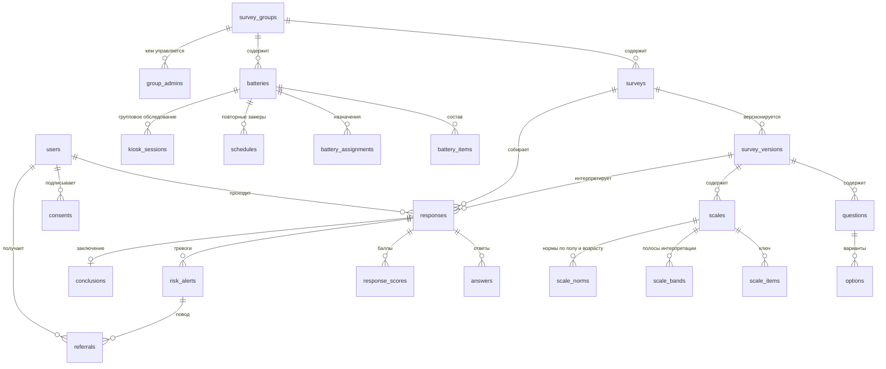

# Устройство системы

Что здесь есть: карта данных, инварианты, которые нельзя нарушать, и модель
угроз. Всё остальное — в коде и комментариях к нему.

Порядок эксплуатации — в [RUNBOOK.md](RUNBOOK.md), план развития — в
[ROADMAP.md](ROADMAP.md), происхождение методик — в
[INSTRUMENTS.md](INSTRUMENTS.md).

---

## Из чего состоит

| Часть | Что делает | Стек |
|---|---|---|
| `apps/api` | вся логика: подсчёт, права, аналитика, фоновые задания | Bun + Hono + Drizzle + PostgreSQL 16 |
| `apps/web` | консоль специалиста: конструктор, аналитика, разбор тревог | Vite + React 19 |
| `apps/mobile` | прохождение методик обследуемым | Expo SDK 57 |
| `packages/shared` | движок подсчёта, схемы, статистика — общие для всех | чистый TypeScript |

Движок подсчёта живёт в `shared` не ради красоты: мобильное приложение
считает профиль офлайн тем же кодом, что и сервер. Расхождение баллов между
устройством и сервером было бы невозможно объяснить обследуемому.

---

## Карта данных

---

## Инварианты

Правила, нарушение которых портит клинические данные молча. Каждое закреплено
тестом; если правило кажется лишним — сначала прочитайте, что оно охраняет.

### Содержимое принадлежит версии, а не методике

Вопросы, шкалы и ключи живут в `survey_version`. Правка методики не изменяет
существующие строки — она создаёт новую версию, а собранные прохождения
остаются привязанными к своей.

Иначе исправление опечатки в пункте задним числом меняло бы смысл ответов,
данных полгода назад. Сравнивать баллы разных версий можно не всегда — на это
отвечает `diffVersions`: он отделяет правки, меняющие смысл балла
(формулировка, ключ, полосы), от косметических (порядок, описание).

### Порядок подсчёта: сначала все сырые баллы, потом поправки

`computeProfile` считает в три прохода: сырые баллы всех шкал → взаимные
поправки (K-коррекция Мини-мульта, композит ЛАП) → нормирование и полосы.

Поправка одной шкалы читает сырой балл другой. Если считать шкалы по очереди
целиком, результат зависит от порядка объявления — и меняется при
перетаскивании шкалы в конструкторе.

### Полосы ищутся по итоговому значению

Полоса интерпретации подбирается после нормирования — по T-баллу или стену, а
не по сырому. Границы в пособиях заданы в нормированной шкале; проверка по
сырому баллу даёт правдоподобные, но неверные степени выраженности.

### Невычислимое возвращает null, а не ноль

Нет норм для пола и возраста — нет T-балла; меньше 50 человек в группе — нет
оценки DIF; меньше 30 исходов — нет ROC. Ноль в этих местах выглядит как
результат и им не является.

То же правило в аналитике: ячейки меньше 5 человек подавляются — не ради
красоты, а против переопознания в маленьком подразделении.

### Видимость данных решается в одном месте

`lib/scope.ts` — единственный источник правды о том, кто что видит.
Суперадмин видит всё; администратор группы — только свои группы плюс
собственные методики без группы; обследуемый — только опубликованное и
назначенное лично ему.

Методика внутри группы управляется **только** через группу: авторство не даёт
доступа, иначе создатель сохранял бы доступ к данным отделения после передачи
методики в чужую группу.

Второй пояс — RLS в самой базе: политики повторяют ту же логику, читая
`app.user_id` и `app.role` из контекста транзакции. Это страховка от забытого
`assertSurveyAccess`, а не замена ему.

### Журнал не переписывается

Каждая запись `audit_log` несёт номер, хэш предыдущей записи и свой хэш от
канонизированной строки. Триггеры базы запрещают UPDATE и DELETE.
`bun run audit:verify` проходит цепочку целиком.

Чтения тоже журналируются: в клинической системе «кто смотрел карту» — такой
же факт, как «кто её изменил».

### Клинические данные не удаляются

Методику можно только снять с использования. Группу нельзя удалить, пока в
ней что-то есть. Батарею — если она хоть раз назначалась. Учётную запись,
создавшую методики, держит внешний ключ `RESTRICT`.

Причина одна: по внешним ключам удаление одной строки уносит прохождения,
баллы и тревоги живых людей. Физическая чистка возможна, но только с сервера,
с подтверждением названия и записью в журнал — см. RUNBOOK.

### Персональные поля шифруются, числовые — нет

ФИО, дата рождения и свободный текст лежат в базе как
`enc1:<ключ>:<вектор>:<шифртекст>`. Баллы не шифруются: по ним считается вся
аналитика, а расшифровывать выборку целиком на каждый отчёт бессмысленно.

Из этого следует неочевидное: **пол и возрастную группу нельзя вычислить
запросом**. Поэтому они снимаются снимком в момент сдачи
(`respondent_sex`, `respondent_age_band`) — иначе стратифицированная
аналитика была бы невозможна.

---

## Модель угроз

Что защищаем, от кого и чем. Оценка честная: где защиты нет, так и написано.

### Что защищаем

Результаты психодиагностики военнослужащих: суицидальный риск, дезадаптация,
личностный профиль. Утечка бьёт по карьере и по жизни человека, а не по
кошельку — восстановить репутацию после разглашения нельзя.

### Кто противник

| Кто | Чего хочет | Чем закрыто |
|---|---|---|
| Любопытный сотрудник | посмотреть чужое подразделение | скоуп групп + RLS + журнал чтений |
| Командир | получить результаты подчинённых напрямую | нет учётной записи; только направление через специалиста |
| Обследуемый | подделать результат | шкалы достоверности, телеметрия ответов, person-fit |
| Внешний злоумышленник | добраться до базы | TLS, CSP, лимиты попыток входа, короткий access-токен |
| Тот, кто получил бэкап | прочитать ФИО | шифрование персональных полей отдельным ключом |
| Тот, кто получил доступ к базе | подчистить следы | хэш-цепочка журнала, триггеры на UPDATE/DELETE |

### Что закрыто

- **Вход.** Access-токен на 30 минут, одноразовый refresh с ротацией и
  отзывом семейства при повторном использовании. Лимит попыток на пару
  «почта + адрес», блокировка со счётчиком в журнале. Пароль от 12 символов
  со сверкой по списку утёкших.
- **Транспорт.** TLS до Caddy, HSTS, CSP без внешних источников, CORS по
  списку, ограничение размера тела.
- **Права.** Скоуп групп в приложении, RLS в базе, роль приложения — не
  владелец схемы.
- **Данные.** Шифрование персональных полей AES-256-GCM с ротацией ключей.
  Согласие обследуемого с версией текста и датой. Срок хранения телеметрии.
- **Следы.** Неудаляемый журнал с хэш-цепочкой, включая чтения.
- **Ошибки персонала.** Ничего клинического не удаляется одним нажатием;
  необратимое требует перепечатать название; демонстрационная учётка не
  может изменить ничего.

### Чего нет — и это осознанно

- **Второй фактор.** Не внедрён. Для учреждения без своей службы каталогов
  это заметная работа, а выигрыш при коротком токене и лимите попыток
  умеренный. Первый кандидат, если появится доступ снаружи периметра.
- **Сквозное шифрование.** Сервер видит расшифрованные данные — иначе он не
  сможет ни считать баллы, ни строить аналитику. Защита от администратора
  сервера здесь не техническая, а организационная: журнал.
- **Внешний аудит и сертификация.** Не проводились. Всё перечисленное —
  добросовестная инженерия, а не подтверждённое соответствие требованиям.
- **Защита от вредоносного суперадмина.** Он может выдать себе доступ к любой
  группе. Заметить это можно только по журналу — цепочка не даст стереть
  запись, но и не помешает действию.
- **Анонимность.** Псевдонимный режим не сохраняет ФИО, но почта нужна для
  входа и хранится. Обследуемому это сказано прямым текстом при регистрации.

### Как это проверяется

`bun test` (движок, права, скоуп, тревоги), `bunx playwright test` (сквозные
сценарии и доступность), `bun run audit:verify` (целостность журнала),
восстановление бэкапа на чистую базу. Ручной чек-лист ввода в эксплуатацию —
в RUNBOOK.
